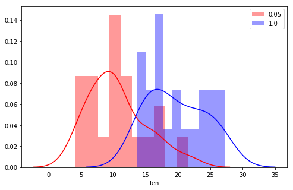

### Section 21 - Other Stuff

### Questions
* power testing lab
    * setting and choosing values for hypothesis testing

### Objectives
YWBAT 
* define welch's ttest
* define a power test
* explain when to use a power test
* explain effect size
* apply anova testing to a dataset
* apply tukey testing to the same dataset

### Outline


```python
import pandas as pd
import numpy as np
import scipy.stats as stats

import matplotlib.pyplot as plt
import seaborn as sns
```

### Welch's TTest
* When 
    * use this when we want to compare some statistic (mean, std, var) between two independent populations/samples, where are variances are not equal
* What
    * alternative test for the student ttest that doesn't require equal variances
    

### Power Test
* When
    * We want to test how significant a null hypothesis is compared to the alternative hypothesis...
* What
    * Power is the probability of correctly rejecting the null
    * 1 - P is the probability of failing to reject (pred 0) when you should reject the null (actual 1)
    * 1 - P is the probability of making a type II error. 

### Let's go through an example


```python
df = pd.read_csv("ToothGrowth.csv")
df.head()
```


<div>
<style scoped>
    .dataframe tbody tr th:only-of-type {
        vertical-align: middle;
    }

    .dataframe tbody tr th {
        vertical-align: top;
    }

    .dataframe thead th {
        text-align: right;
    }
</style>
<table border="1" class="dataframe">
  <thead>
    <tr style="text-align: right;">
      <th></th>
      <th>len</th>
      <th>supp</th>
      <th>dose</th>
    </tr>
  </thead>
  <tbody>
    <tr>
      <td>0</td>
      <td>4.2</td>
      <td>VC</td>
      <td>0.5</td>
    </tr>
    <tr>
      <td>1</td>
      <td>11.5</td>
      <td>VC</td>
      <td>0.5</td>
    </tr>
    <tr>
      <td>2</td>
      <td>7.3</td>
      <td>VC</td>
      <td>0.5</td>
    </tr>
    <tr>
      <td>3</td>
      <td>5.8</td>
      <td>VC</td>
      <td>0.5</td>
    </tr>
    <tr>
      <td>4</td>
      <td>6.4</td>
      <td>VC</td>
      <td>0.5</td>
    </tr>
  </tbody>
</table>
</div>


```python
df.supp.unique()
```


    array(['VC', 'OJ'], dtype=object)


```python
df.dose.unique()
```


    array([0.5, 1. , 2. ])


```python
len_dose_05 = df.loc[df["dose"]==0.5, 'len']
len_dose_1  = df.loc[df["dose"]==1.0, 'len']
```


```python
# let's do an indepedent ttest

# test for normality
# use shapiro (high pvalue (greater than 0.05) -> normality)
stats.shapiro(len_dose_05), stats.shapiro(len_dose_1)
```


    ((0.940645158290863, 0.2466018795967102),
     (0.9313430190086365, 0.16388124227523804))


```python
# test for equal variances
# H0: v1 = v2
# HA: v1 != v2
# p < 0.05 reject H0
# p >= 0.05 fail to reject H0

stats.levene(len_dose_05, len_dose_1)

# pvalue=0.59 indicates that the variances are equal with 0.95% confidence
```


    LeveneResult(statistic=0.28717937234792845, pvalue=0.5951568306652302)


```python
# equal variances and normal -> student ttest
# H0: mu1 = mu2
# HA: mu1 != mu2
# p < 0.05 reject H0
# p >= 0.05 fail to reject H0

stats.ttest_ind(len_dose_05, len_dose_1)

# pvalue = 0 indicates we reject the null which means the means are not equal. 
```


    Ttest_indResult(statistic=-6.476647726589102, pvalue=1.2662969613216514e-07)


```python
plt.figure(figsize=(8, 5))
sns.distplot(len_dose_05, color='r', bins=10, label='0.05')
sns.distplot(len_dose_1, color='b', bins=10, label='1.0')
plt.legend()
plt.show()
```





Let's calculate effect size in order to calculate the power


```python
from numpy import std, mean, sqrt

#correct if the population S.D. is expected to be equal for the two groups.
def cohen_d(x,y):
    nx = len(x)
    ny = len(y)
    dof = nx + ny - 2
    return (mean(x) - mean(y)) / sqrt(((nx-1)*std(x, ddof=1) ** 2 + (ny-1)*std(y, ddof=1) ** 2) / dof)
```


```python
cohen_d(len_dose_1, len_dose_05)
```


    2.048095841857304


### Effect size of 2.04, let's us calculate the power


```python
from statsmodels.stats.power import TTestIndPower, TTestPower
```


```python
ind_power = TTestIndPower()
```


```python
# plug in the effect size from above
power = ind_power.solve_power(effect_size=2.048095841857304, nobs1=len(len_dose_1), alpha=0.05)

type_ii_error_rate = 1 - power
type_ii_error_rate
```


    0.0


### Let's summarize these findings

A dose of 0.05 will result in less tooth growth with almost 95% confidence. The probablity that we would see a growth that looks like it came from the doseage group of 1.0 but it actually came from the dosage group of 0.05 is almost 0%, because our power value is 1.0.  

### Assessment
* the effect that each variable has on the power rate
* you have to have the effect size before you can calculate the power
* That power tests measure the probability of rejecting the null hyp given it’s false. And that 1/close to 1 means it’s a good fit
* The importance of sample size and variance on error
* the 'separatedness' of the distributions causes a high effect size


```python

```
